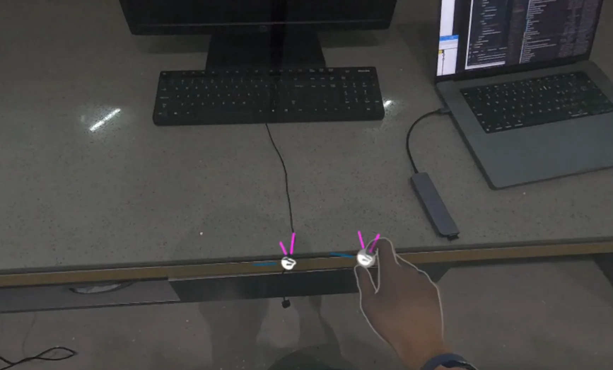
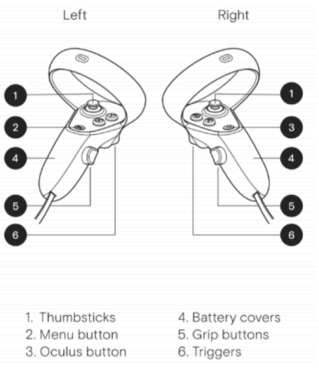

# CritterEscape AR Version
## Prerequisites

### Hardware
- **PC VR setup (via Meta Quest Link)**  
  For detailed requirements, please refer to:  https://www.meta.com/help/quest/140991407990979/
    - **2 PCs**
    - **Compatible Link cables**
    - **2 Meta Quest 3 headsets with controllers**
- **Stable Wi-Fi network** (Required for multiplayer)

### Software
- **Unity 2022.3.52f1** (Recommeneded. Newer Unity Editor versions may introduce compatibility issues and require manual fixes.)
- **Meta Horizon Link**
- **Blender**  (If Blender is not installed, some 3D models may lose their meshes.)

## Installation Instructions
> This section assumes you are running the **prebuilt executable** version.

1. Go to: [Builds](/CritterEscape-AR/Builds)
2. Copy the .apk file to the headset via USB
3. Use the Mobile VR Station application to install the .apk file, please refer to https://www.youtube.com/watch?v=60_YqA-AmGk

## In-Game Setup

### 1. Spatial Anchors

Both players place **two spatial anchors** at the **same physical location** using **pinch gestures**.

**Gesture:** Right Hand Pinch (touch right thumb and index finger together).

**Anchor Placement:**

- **First Anchor:** Defines the origin `(0, 0)` for the x and z axes.
- **Second Anchor:** Works with the first anchor to ensure consistent rotation throughout the game.

  

> **Tip:** Proper placement of both anchors ensures that both players share the same coordinate system and orientation.

### 2. Network Connection

Ensure both devices are on the **same local network (LAN)**.

**Steps:**

1. One player presses **Create Room** on the game panel.
2. The other player **automatically joins** once the room is created.

## Interaction Guide

  
</p

- Movement
    - Physical movement

- Object Interaction
    - **Grip Buttons (L5 / R5)** Grab and manipulate objects

- UI & Precision Actions
    - **Triggers (L6 / R6)** Interact with 3D UI elements, Perform precise actions (pinch gesture)
