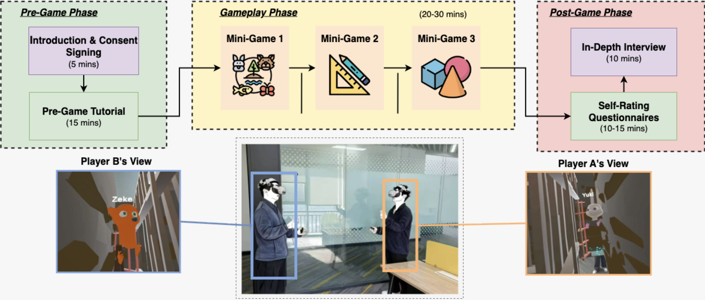
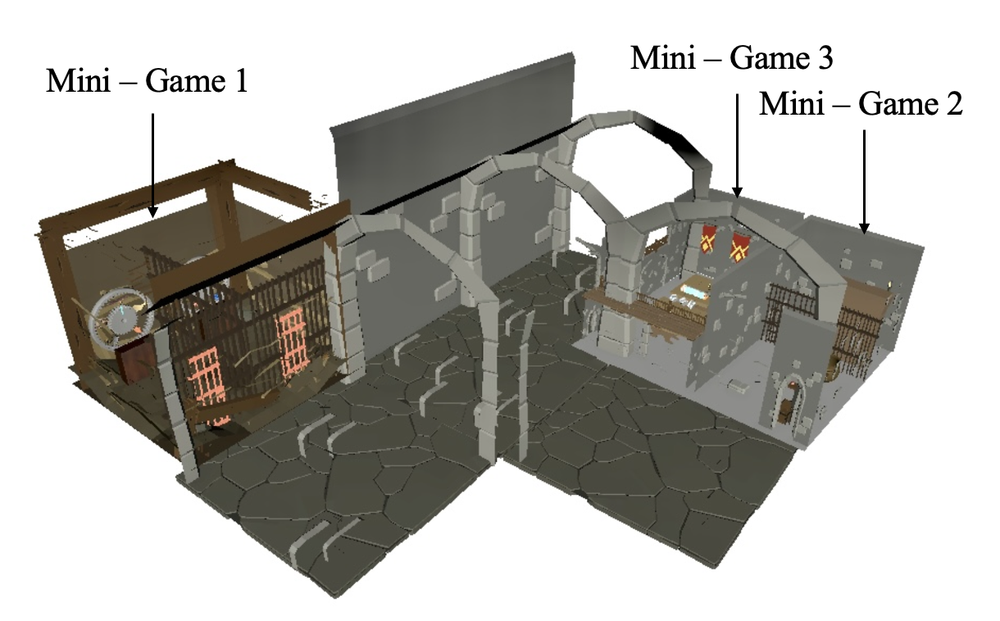
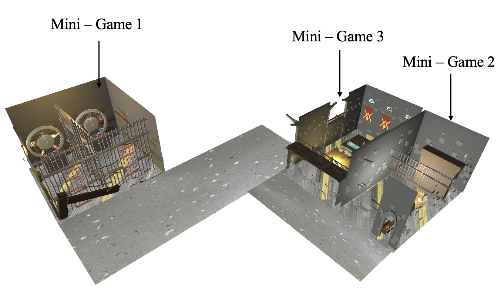

<div align="center">
<h1>CritterEscape 🦊🐰</h1>
<h3>Differential Effects of Virtual and Augmented Reality on Social Presence and Engagement in Collaborative Gaming for Unfamiliar Users [<a href="https://ieeevr.org/2026/">IEEE VR 2026</a>]</h3>

Lijie Zheng*, Guoyueyang Cheng*, Shaoteng Ke, Jiachen Yuan, Yuchen Fan, Boon Giin Lee, Matthew Pike, Alejandro Guerra-Manzanares

<p align='center'>
  <b>
    <a href="https://0">Paper</a>
    |
    <a href="https://github.com/ssygc1/CritterEscape">Code</a> 
  </b>
</p>
</div>

## 📋 Table of Contents

- [Introduction](#-introduction)
- [Game Overview](#-game-overview)
- [Mini-Games & Collaboration Mechanics](#-mini-games--collaboration-mechanics)
- [User Manual](#-user-manual)
- [Citation](#-citation)
- [License](#-license)


## 📷 Introduction

<p align="center">
  
</p>

This paper introduces CritterEscape, an immersive collaborative puzzle game with asymmetric roles in both VR and AR. This project builds upon the foundational research presented in our paper: [Exploring the Influence of Interpersonal Relationships on Gamification Preferences in Collaborative IVR Environments](https://ieeexplore.ieee.org/document/10937399). This study expanded the design that enables a direct comparison of how VR and AR modalities affect user experience and cooperative behavior, allowing for systematic observation of how each medium’s characteristics modulate social interaction under consistent task conditions. Specifically, we investigate how immersive VR and AR environments influence social presence, task engagement, and collaborative dynamics in a cooperative puzzle game setting, focusing particularly on interactions between unfamiliar participants.

## 🎮 Game Overview

**CritterEscape** is a multiplayer educational game designed to increase student learning motivation through social interaction. Players take on distinct roles—Zeke 🦊 and Yuki 🐰—and must communicate effectively to complete collaborative tasks. It consists of three mini-games of varying difficulty levels, based on an escape-room mechanism, in which students collaborate to solve puzzles and progress to the next game. The puzzles primarily involve STEM knowledge, aiming to promote critical thinking and problem-solving skills.

<p align="center">
  
  
</p>

<p align="center">
  <b>Left:</b> VR Overview &nbsp;&nbsp; | &nbsp;&nbsp; <b>Right:</b> AR Overview
</p>

## 🧩 Mini-Games & Collaboration Mechanics

This game includes three collaborative mini-games used in the VR/AR study:

- **Mini-Game 1: Animal Identification Puzzle**  
  Informational asymmetry: each player sees clues needed by the other.
- **Mini-Game 2: Potion Brewing Puzzle**  
  Positional asymmetry: players are constrained to different locations/roles to proceed.
- **Mini-Game 3: Shape Alignment Puzzle**  
  Visual asymmetry: each player sees unique parts of the solution and must communicate.


## ✅ User Manual

> ### VR Version
> Built with `Unity XR Interaction Toolkit (XRI)` and the `Photon Fusion` networking framework.  
> **Setup & Requirements:**  
> [CritterEscape-VR/README.md](CritterEscape-VR/README.md)

> ### AR Version
> Built with the `Meta SDK` and the `Mirror` networking framework.  
> **Setup & Requirements:**  
> [CritterEscape-AR/README.md](CritterEscape-AR/README.md)

> ### Tip
> For **multiplayer game testing** in Unity's Play Mode, you can use [ParrelSync](https://github.com/VeriorPies/ParrelSync) to run multiple instances of the game simultaneously.

## 🌟 Citation 
If you are interested in our work, please consider giving a 🌟 and citing our work below.

```bibtex
@misc{critterescape_vrar_ieeevr2026,
  title        = {Differential Effects of Virtual and Augmented Reality on Social Presence and Engagement in Collaborative Gaming for Unfamiliar Users},
  author       = {Lijie Zheng and Guoyueyang Cheng and Shaoteng Ke and Jiachen Yuan and Yuchen Fan and Boon Giin Lee and Matthew Pike and Alejandro Guerra-Manzanares},
  howpublished = {Manuscript prepared for IEEE VR 2026},
  note         = {Submission ID: 1813. Final bibliographic details TBD.},
  year         = {2026},
  url          = {https://ieeevr.org/2026/}
}
```

## 📄 License
This project is licensed under the [MIT License](LICENSE).

